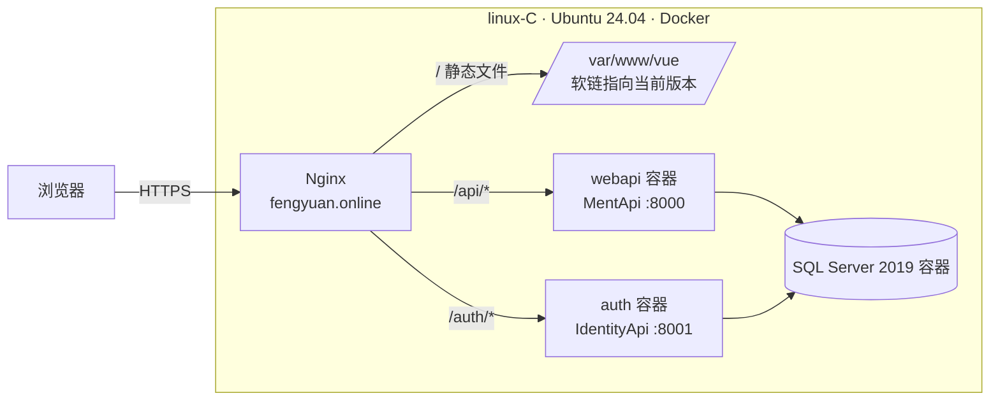
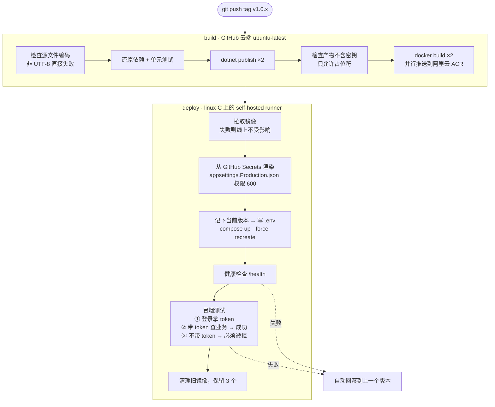

# Zhaoxi.Management · 后台管理系统后端

基于 **.NET 8** 的 RBAC 后台管理系统后端：业务 API 与 JWT 认证服务拆分部署。
这个仓库的重点是**工程化交付**：配置与密钥分离、容器化，打 tag 后自动发布、健康检查、冒烟测试，失败时自动回滚。

[](https://github.com/liangfeng-hash/Zhaoxi.Management/actions/workflows/deploy-linux.yml)

- 线上地址：<https://fengyuan.online>
- 发布记录：[Actions](https://github.com/liangfeng-hash/Zhaoxi.Management/actions)，每次运行都能看到完整日志和各步骤耗时
- 配套仓库：[Zhaoxi.Web](https://github.com/liangfeng-hash/Zhaoxi.Web)（Vue3 前端）· [Zhaoxi.Gateway](https://github.com/liangfeng-hash/Zhaoxi.Gateway)（YARP 网关，Windows 环境用）

## 技术栈

| 分类 | 选型 |
| --- | --- |
| 框架 | ASP.NET Core 8 WebAPI、AutoMapper、Swagger |
| 数据 | SqlSugar（CodeFirst）+ SQL Server 2019 |
| 认证授权 | 独立 IdentityApi 签发 JWT（HS256，AccessToken + RefreshToken）；业务侧按菜单/按钮做细粒度授权 |
| 部署 | Docker Compose、阿里云 ACR 镜像仓库、Nginx 反向代理 + HTTPS |
| CI/CD | GitHub Actions：云端 runner 负责构建，服务器上的 self-hosted runner 负责部署 |

## 系统架构



| 服务 | 职责 |
| --- | --- |
| `Zhaoxi.Manage.IdentityApi` | 登录、签发和刷新 Token |
| `Zhaoxi.Manage.MentApi` | 用户、角色、菜单、文件等业务接口；启动时反射 `[Function]` 特性，生成菜单和按钮权限数据 |
| `BusinessInterface` / `BusinessService` | 服务层接口与实现 |
| `Models` / `Common` | 实体、DTO、通用工具 |
| `Zhaoxi.Manage.Tests` | 单元测试，流水线里改动线上之前先跑 |

## 发布流水线

只有打 `v*` tag 才会发布，平时推代码不会动线上。



### 设计取舍

| 问题 | 做法 | 原因 |
| --- | --- | --- |
| 部署怎么触发 | 服务器上跑 self-hosted runner，**主动出站**连接 GitHub | 不开 SSH 等入站端口，服务器密码也不用放进 GitHub；不用 webhook，是因为 webhook 触发后拿不到部署结果，失败了也不知道 |
| 在哪里构建 | GitHub 云端 runner | 服务器只有 4 核 3.6G，构建不占用线上资源 |
| 产物怎么传到服务器 | 推镜像仓库，服务器 `docker pull` | 服务器从 GitHub 直接下载只有 ~20KB/s；镜像仓库在国内，拉取快 |
| 为什么选阿里云 ACR | 一开始用腾讯云 TCR 个人版，从 GitHub 推送只有 ~30KB/s，推一次要 10 分钟；换到阿里云 ACR 后几秒完成 | 做了对照实验：画出数据流向，排除服务器带宽的影响，再换一家仓库比较 |
| 密钥怎么管理 | 仓库里的 `appsettings.json` 只放 `__REPLACE_ME__` 占位符；真实值按 key 存进 GitHub Secrets，部署时渲染成文件，以只读方式挂进容器 | 镜像里不含任何密钥，同一个镜像可以部署到任何环境；构建时还会检查产物，防止密钥被打进镜像 |
| 怎么证明发布成功 | 健康检查只能说明进程还活着，所以额外加了**三步冒烟测试** | JWT 密钥不一致、鉴权被误关、连错数据库这类故障，健康检查照样是绿的 |
| 基础镜像 | 固定到补丁版本 `aspnet:8.0.31` | 用浮动的 `8.0` 标签时，基础镜像每月都会变：一是要重新上传 86MB 的基础层，二是同一份代码两次构建的结果可能不同 |

### 实际踩过的坑

- **上线后菜单全是 `???`**：有 7 个 `.cs` 文件是 GBK 编码。在 Windows 上构建时，系统默认代码页正好能读 GBK，所以一直没暴露；到 Linux 上构建，中文被当成 UTF-8 解码就坏了。修复方法是把源文件统一转成 UTF-8 BOM，加上 `.editorconfig`，并在构建第一步检查编码。见 [v1.0.7](https://github.com/liangfeng-hash/Zhaoxi.Management/releases/tag/v1.0.7)。
- **.NET 8 容器起来了但连不上**：.NET 8 官方镜像的默认端口从 80 改成了 8080。
- **只改了 Secret，重新发布不生效**：单文件 bind mount 绑定的是 inode，`compose up -d` 检测不到变化就不会重建容器，要加 `--force-recreate`。
- **ufw 没开 1433，公网却能连上数据库**：Docker 的端口转发走 iptables 的 DOCKER 链，会绕过 ufw。解决办法是端口只绑定到 `127.0.0.1`。
- **鉴权失败也返回 HTTP 200**：业务错误码写在 body 里，所以冒烟测试必须判断 `success` 字段，不能只看 HTTP 状态码。

## 多环境

| 环境 | 部署方式 | 流水线 |
| --- | --- | --- |
| 生产 linux-C | Docker + Nginx | `deploy-linux.yml`（tag 触发） |
| 本机 Windows | IIS + YARP 网关负载均衡 | `deploy-local.yml`（`app_offline.htm` 平滑发布，robocopy 同步，失败有备份可恢复） |

## 本地运行

```bash
# 1. 在 appsettings.Development.json 里填连接串、JWT 密钥（两个 API 必须一致）
# 2. IsInitDatabase=1 时，MentApi 启动会自动建库建表并创建管理员账号
dotnet run --project Zhaoxi.Manage.IdentityApi
dotnet run --project Zhaoxi.Manage.MentApi
```

> ⚠️ `IsInitDatabase=1` 会在每次启动时重建菜单表和按钮表，别把它指向有重要数据的库。
